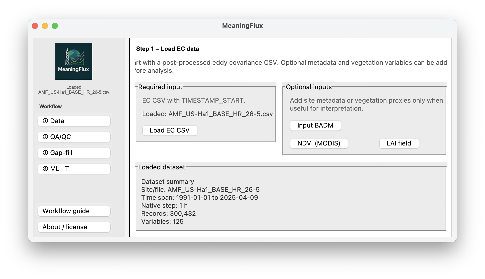

<p align="center">
  
</p>

# MeaningFlux

**MeaningFlux** is an open-source Python graphical workflow for exploratory analysis, machine learning, and information-theoretic interpretation of eddy-covariance (EC) data.

It connects conventional EC data exploration and quality assessment with machine-learning prediction and information-theory diagnostics. MeaningFlux helps users ask not only **how well a model predicts a flux**, but also **whether its predictions preserve the observed information relationships between fluxes and environmental drivers**.

<p align="center">
  
</p>

> **Typical workflow:** Load EC data → Explore and QA/QC → Gap-fill when needed → Run ML → Create the ML-to-IT bridge → Compare observed and modeled information structure

MeaningFlux is a post-processing and interpretation tool. It does not replace standard EC processing, site-specific quality control, or process-based scientific interpretation.

## AmeriFlux 2026 Workshop

Materials for the hands-on **MeaningFlux workshop at the 2026 AmeriFlux Annual Meeting** are available in the [`workshop`](workshop/) folder.

The folder contains participant instructions, workshop installation requirements, and links to the sample AmeriFlux dataset and presentation materials. Please complete the installation before the session by following the [`workshop/README.md`](workshop/README.md).

## Core Capabilities

### EC exploration and visualization

- Time-series and daily-average visualization
- Density and scatter plots
- Correlation analysis
- Wind and fetch roses
- Directional flux-contribution diagnostics
- Data-availability assessment
- Flux-budget calculations

### QA/QC and gap filling

- Guided standard QA/QC
- AmeriFlux BASE QA/QC
- Missing-data and completeness assessment
- ONEFlux-based gap filling and CO2 partitioning utilities
- N2O and CH4 gap filling

Original and gap-filled variables remain distinguishable to preserve data provenance.

### Footprint and source-area context

- Flux Footprint Prediction calculations
- Footprint climatology
- Fetch and directional source-area visualization
- BADM/site metadata support

### Machine Learning Toolbox

Supported models include:

- Linear Regression
- Random Forest
- Multilayer Perceptron (MLP)
- Long Short-Term Memory network (LSTM)
- Hysteresis-Gate LSTM (H-LSTM)

MeaningFlux supports native, daily, and weekly analyses, with chronological holdout validation and expanding-window blocked cross-validation. Diagnostics include R², RMSE, normalized RMSE, MAE, fold-level performance, observed-versus-predicted plots, and held-out Random Forest permutation importance.

Common target variables include FC/NEE, FCH4, FN2O, LE, H, GPP, and RECO. Other numeric targets can also be selected.

An optional exploratory driver-screening workflow compares literature-informed presets, Random Forest permutation importance, Pearson correlation, standardized linear coefficients, and partial-dependence diagnostics. These results support screening and should not be interpreted as definitive attribution of ecosystem controls.

### ML-to-IT Bridge

After fitting models, MeaningFlux can export a timestamp-aligned table containing environmental drivers, the observed target, model predictions, residuals, temporal metadata, and evaluation labels. This common structure allows the Information Theory Toolbox to analyze the same environmental relationships in observations and predictions.

### Information Theory Toolbox

- Entropy
- Mutual information and normalized mutual information
- Driver ranking and correlation-versus-MI comparison
- Conditional mutual information
- Lagged mutual information
- Two-source and pairwise partial information decomposition (PID)
- Transfer entropy across lags and directed TE networks
- Temporal surrogate testing
- Daytime, nighttime, seasonal, monthly, and custom analysis windows

PID separates redundant, unique, and synergistic information supplied by pairs of drivers. Transfer entropy evaluates directional lagged information structure while conditioning on the target's past; it is not, by itself, proof of physical causality.

### Model Information Fidelity

MeaningFlux complements predictive metrics by comparing the information structure of observed and modeled fluxes:

- **Model-vs-Observed MI:** compares driver-target dependence in observations and predictions.
- **Model-vs-Observed PID:** compares redundancy, uniqueness, and synergy.
- **Functional Performance Summary:** combines individual-driver MI fidelity and pairwise PID fidelity.

A model can predict a flux well while still misrepresenting its environmental information relationships. MeaningFlux therefore treats **predictive skill** and **information fidelity** as complementary dimensions of evaluation.

## Installation

MeaningFlux supports Python 3.10. Clone the repository and enter its directory:

```bash
git clone https://github.com/LBL-EESA/MeaningFlux.git
cd MeaningFlux
```

Create and activate a Conda environment:

```bash
conda create -n meaningflux python=3.10 -y
conda activate meaningflux
```

Install the standard dependencies:

```bash
python -m pip install --upgrade pip
pip install -r requirements.txt
```

Some advanced workflows may require optional packages that are not included in the standard installation. For the AmeriFlux 2026 hands-on session, use the dedicated [workshop instructions](workshop/README.md).

## Running MeaningFlux

From the repository root:

```bash
python scripts/MeaningFlux_main.py
```

The graphical interface will open in a separate window. Keep the terminal open while using the program.

## Data Requirements

MeaningFlux is designed for post-processed EC datasets stored as tabular files such as CSV. A typical input contains:

- a timestamp column, preferably `TIMESTAMP_START`
- one or more EC flux variables
- environmental or ecosystem predictor variables
- a regular or inferable temporal resolution

AmeriFlux-style missing-value codes such as `-9999` are treated as missing where supported. Datasets do not need to contain identical variables; select the target, drivers, time window, and preprocessing appropriate to the scientific question.

## Repository Structure

```text
MeaningFlux/
├── scripts/
│   └── MeaningFlux_main.py
├── src/
│   ├── open_machine_learning_toolbox.py
│   ├── open_information_theory_toolbox.py
│   ├── oneflux_py3/
│   └── visualization, QA/QC, gap-filling, and footprint modules
├── docs/
│   └── images and documentation
├── workshop/
│   ├── README.md
│   └── requirements-workshop.txt
├── requirements.txt
├── CITATION.cff
├── LICENSE.txt
└── README.md
```

## Scientific Interpretation

Information-theory metrics identify statistical information relationships; they do not independently establish physical mechanisms or causality. Interpret results in the context of ecosystem processes, target definition, temporal aggregation, day/night structure, seasonality, autocorrelation, variable selection, data coverage, site characteristics, and preprocessing choices.

## Citation

If MeaningFlux contributes to your research, analyses, figures, or publication, please cite the software:

**Hernandez Rodriguez, L. C. (2026). _MeaningFlux v1.0_ [Computer software]. Lawrence Berkeley National Laboratory.**

- [DOE CODE/OSTI software record](https://www.osti.gov/doecode/biblio/178023)
- [Source code](https://github.com/LBL-EESA/MeaningFlux)

The repository includes a [`CITATION.cff`](CITATION.cff) file for citation export through GitHub. A manuscript describing the MeaningFlux framework and technical validation has been submitted to the *Journal of Geophysical Research: Biogeosciences*.

## Author

**Leila Hernandez Rodriguez**  
Postdoctoral Research Fellow  
Energy Geosciences Division  
Lawrence Berkeley National Laboratory

- [GitHub](https://github.com/leilaher)
- [LinkedIn](https://www.linkedin.com/in/leilaher/)

## Funding

Development of MeaningFlux and portions of the associated analyses were supported by the SMARTFARM program of the U.S. Department of Energy's Advanced Research Projects Agency–Energy (ARPA-E). Additional project-specific funding and acknowledgments are provided in the associated publications.

## Feedback and Contributions

Users are encouraged to test MeaningFlux with their own EC datasets, report bugs or unexpected behavior, suggest improvements, and contribute reproducible examples. Please use the repository's [GitHub Issues](https://github.com/LBL-EESA/MeaningFlux/issues) page.

## Disclaimer

MeaningFlux is provided for research and educational purposes. Users are responsible for verifying input-data quality, selecting scientifically appropriate variables and analysis windows, validating model outputs, and interpreting results in the appropriate ecological and physical context.

## Copyright and License

MeaningFlux Copyright © 2026, The Regents of the University of California, through Lawrence Berkeley National Laboratory (subject to receipt of any required approvals from the U.S. Department of Energy). All rights reserved.

This software was developed under U.S. Department of Energy funding. The U.S. Government retains certain rights, including a paid-up, nonexclusive, irrevocable, worldwide license to reproduce, distribute, prepare derivative works, publicly perform, and publicly display the software, and to permit others acting on its behalf to do so.

For questions about rights to use or distribute this software, contact Berkeley Lab's Intellectual Property Office at `IPO@lbl.gov`.

See [`LICENSE.txt`](LICENSE.txt) for the complete license and terms of use.
